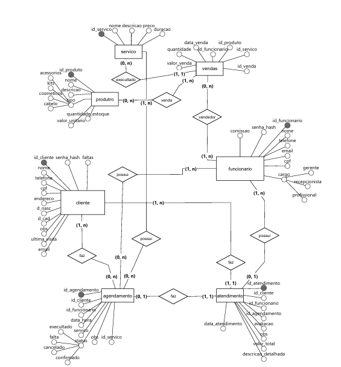

# 💇‍♀️ Sistema de Gestão para Salão de Beleza

Este projeto é um sistema de gerenciamento para salões de estética, desenvolvido com o framework **Laravel 11** e banco de dados **MariaDB**, seguindo o padrão de arquitetura **MVC**.

## 📊 Diagrama de Banco de Dados
Abaixo está a estrutura conceitual que fundamenta a integridade do sistema:

## 👥 Equipe e Responsabilidades
A equipe está organizada de acordo com as camadas do padrão **MVC** e gestão ágil:

| Integrante | Função | Responsabilidades principais |
| :--- | :--- | :--- |
| **Geovanna Vieira** | Gerente de Projeto | Guia a equipe, organiza cronogramas e relatórios. |
| **Alessandro Lima** | Dev. Back-end | Implementação do **Model** (Banco) e **Controller** (Lógica). |
| **Sophia Ribeiro** | Dev. Front-end | Implementação da **View** (Interface Blade e CSS). |
| **Eliene de Sousa** | Auxiliar | Suporte ao desenvolvimento Front-end e Back-end. |
| **Anthony Almeida** | Auxiliar | Suporte ao desenvolvimento Front-end e Back-end. |

## 🛠️ Tecnologias e Convenções
* **Linguagem:** PHP 8.5+ (Padronizado em Português).
* **Banco de Dados:** MariaDB com Engine **InnoDB**.
* **Nomenclatura:** `PascalCase` para Classes, `snake_case` para Banco, `camelCase` para Funções.
* **Versionamento:** Padrões de Commits fixos (`[FEAT]`, `[FIX]`, `[DOCS]`, `[STYLE]`).

## 🏗️ Padrões de Projeto (MVC)
* **Model:** Camada que gerencia os dados e a comunicação com o MariaDB.
* **View:** Interface desenvolvida com o motor de templates Blade.
* **Controller:** O "cérebro" que processa as requisições e regras de negócio.

## 📝 Documentação e Commits
* **Comentários:** Todo arquivo possui cabeçalho com nome do autor e data.
* **Mensagens de Commit:**
    * `[FEAT]`: Para novas funcionalidades.
    * `[FIX]`: Para correção de problemas.
    * `[DOCS]`: Para atualizações de documentação e README.
    * `[STYLE]`: Para atualizar ou inplementação da interface.

## 🚀 Como Visualizar a Estrutura
* `src/app/Models`: Representação das entidades (Clientes, Agendamentos, etc).
* `src/app/Http/Controllers`: Lógica de processamento e regras de negócio.
* `src/resources/views`: Interface do usuário.
* `src/database/migrations`: Scripts de criação das tabelas no MariaDB.